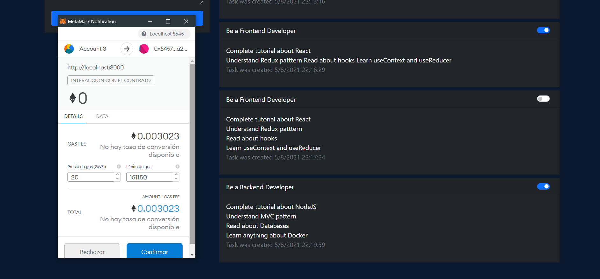

<h1 align="center">
   
  DAPP - TODO
   
</h1>

# Description

Practices carried out in a course in order to learn concepts about metamask, blockchain and smartcontracts
 
Used Technologies: Javascript, Solidity, Truffle and Ganache

# Screenshots

### ToDo

